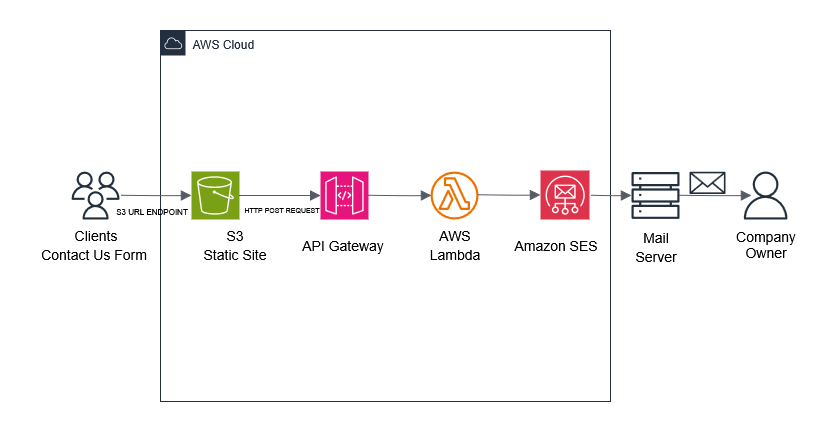
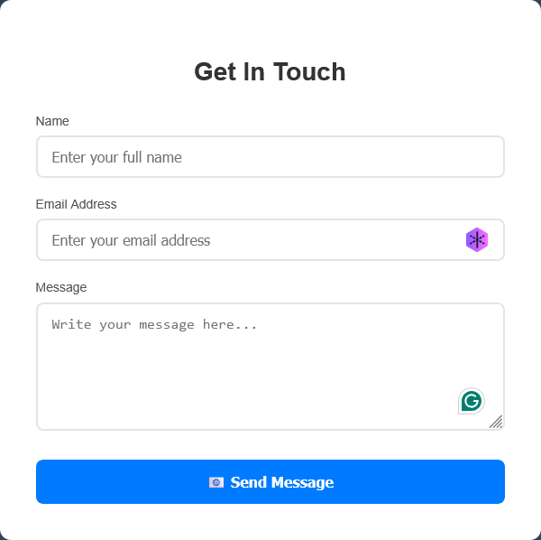

# Serverless Contact Form with AWS

*If this README confuses you, imagine how I felt writing the code😂*

## Overview 

This is a comprehensive serverless contact form solution utilizing AWS Lambda, API Gateway, SES, and S3 for static hosting.

## Architecture

```
S3 Static Website → API Gateway → Lambda Function → Amazon SES → Email Delivery
```


## Contact Form Preview



The contact form features a modern, responsive design with:
- Clean, professional styling with gradient background
- Real-time form validation and user feedback
- Loading states and success/error messaging
- Mobile-responsive layout
- Smooth animations and hover effects

## Features

- ✅ Serverless architecture (no servers to manage)
- ✅ CORS-enabled for cross-origin requests
- ✅ Form validation and error handling
- ✅ HTML and text email formats
- ✅ Real-time form submission feedback
- ✅ Cost-effective (pay-per-use)

## Project Structure

```
Serverless-contact-form-with-AWS/
├── contact.html          # Contact form HTML page with React integration
├── contact.js           # React-based frontend component
├── lambda_function.py   # AWS Lambda backend function
├── contact-form.png     # Contact form UI preview
├── Serverless.drawio.png # Architecture diagram
└── README.md           # This documentation
```

## Prerequisites

- AWS Account with appropriate permissions
- Verified email addresses in Amazon SES
- Basic knowledge of AWS services

## Setup Instructions

### 1. Amazon SES Configuration

1. **Verify Email Addresses:**
   ```
   AWS Console → Simple Email Service (SES) → Verified identities
   ```
   - Add and verify your sender email address
   - Add and verify your recipient email address
   - Check your email for verification links

2. **Check SES Sandbox Status:**
   - If in sandbox mode, both sender and recipient must be verified
   - Request production access if needed for unrestricted sending

### 2. Lambda Function Setup

1. **Create Lambda Function:**
   ```
   AWS Console → Lambda → Create function
   ```
   - Runtime: Python 3.12
   - Function name: `contactformfxn` (or your preferred name)

2. **Upload Code:**
   - Copy the contents of `lambda_function.py`
   - Paste into the Lambda function editor
   - Click "Deploy"

3. **Set Environment Variables (Optional):**
   ```
   Configuration → Environment variables
   ```
   - `SENDER_EMAIL`: your-sender@domain.com
   - `RECIPIENT_EMAIL`: your-recipient@domain.com

4. **Configure IAM Permissions:**
   ```
   Configuration → Permissions → Execution role
   ```
   Add SES permissions to the Lambda execution role:
   ```json
   {
       "Version": "2012-10-17",
       "Statement": [
           {
               "Effect": "Allow",
               "Action": [
                   "ses:SendEmail",
                   "ses:SendRawEmail",
                   "ses:ListVerifiedEmailAddresses"
               ],
               "Resource": "*"
           }
       ]
   }
   ```

### 3. API Gateway Setup

1. **Create REST API:**
   ```
   AWS Console → API Gateway → Create API → REST API
   ```

2. **Create Resource:**
   - Resource name: `contact`
   - Resource path: `/contact`

3. **Create POST Method:**
   - Method: POST
   - Integration type: Lambda Function
   - Lambda Function: Select your function

4. **Enable CORS:**
   ```
   Actions → Enable CORS
   ```
   - Access-Control-Allow-Origin: `*`
   - Access-Control-Allow-Headers: `Content-Type`
   - Access-Control-Allow-Methods: `POST,OPTIONS`

5. **Deploy API:**
   ```
   Actions → Deploy API
   ```
   - Stage name: `test` (or your preferred stage)
   - Note the Invoke URL for frontend configuration

### 4. S3 Static Website Hosting

1. **Create S3 Bucket:**
   ```
   AWS Console → S3 → Create bucket
   ```
   - Bucket name: `your-website-bucket`
   - Uncheck "Block all public access"

2. **Enable Static Website Hosting:**
   ```
   Properties → Static website hosting → Enable
   ```
   - Index document: `contact.html`

3. **Upload Files:**
   - Upload `contact.html` and `contact.js`

4. **Set Bucket Policy:**
   ```json
   {
       "Version": "2012-10-17",
       "Statement": [
           {
               "Sid": "PublicReadGetObject",
               "Effect": "Allow",
               "Principal": "*",
               "Action": "s3:GetObject",
               "Resource": "arn:aws:s3:::your-website-bucket/*"
           }
       ]
   }
   ```

### 5. Frontend Configuration

Update the API Gateway URL in `contact.js`:
```javascript
const response = await fetch('https://YOUR-API-ID.execute-api.REGION.amazonaws.com/STAGE/contact', {
```

## Usage

1. **Access the Contact Form:**
   ```
   http://your-website-bucket.s3-website-REGION.amazonaws.com/contact.html
   ```

2. **Fill out the form:**
   - Name (required)
   - Email (required)
   - Message (required)

3. **Submit and receive confirmation**

## File Details

### contact.html
- Complete HTML document with contact form
- Includes favicon link to prevent 404 errors
- References external JavaScript file

### contact.js
- React-based contact form component with modern UI
- Handles form submission with fetch API
- Real-time form validation and state management
- Professional styling with CSS-in-JS approach
- Loading states and comprehensive error handling
- Responsive design with gradient background

### lambda_function.py
- Processes form data from API Gateway
- Handles both API Gateway and direct Lambda test formats
- Sends emails via Amazon SES with HTML and text formats
- Comprehensive error handling and logging
- CORS headers for all responses

## Troubleshooting

### Common Issues

1. **CORS Errors:**
   - Ensure CORS is enabled in API Gateway
   - Check that Lambda returns proper CORS headers
   - Redeploy API Gateway after changes

2. **Email Not Received:**
   - Verify email addresses in SES console
   - Check spam/junk folders
   - Ensure Lambda has SES permissions
   - Check CloudWatch logs for errors

3. **Lambda Permission Errors:**
   - Add SES permissions to Lambda execution role
   - Verify IAM policy allows `ses:SendEmail`

4. **API Gateway 400 Errors:**
   - Check request body format
   - Verify API Gateway integration
   - Review Lambda function logs

### Debugging

1. **Check CloudWatch Logs:**
   ```
   AWS Console → CloudWatch → Log groups → /aws/lambda/your-function-name
   ```

2. **Test Lambda Function:**
   ```
   Lambda Console → Test → Create test event
   ```
   Test event format:
   ```json
   {
       "name": "Test User",
       "email": "test@example.com",
       "message": "Test message"
   }
   ```

3. **Test API Gateway:**
   ```
   API Gateway Console → Resources → POST → Test
   ```

## Cost Estimation

- **Lambda:** ~$0.20 per 1M requests
- **API Gateway:** ~$3.50 per 1M requests
- **SES:** ~$0.10 per 1,000 emails
- **S3:** ~$0.023 per GB storage + data transfer

## Security Considerations
*In the event you create a production-ready project*
- Email addresses are validated on the frontend and backend.
- CORS is configured to allow specific origins.
- Input sanitization prevents SQL injection attacks.
- Rate limiting can be added via API Gateway.

## Future Enhancements
*Disclaimer* This is for anyone looking to improve on the project.
- Adding reCAPTCHA for spam protection
- Implementing email templates with SES
- Adding form field validation
- Store submissions in DynamoDB
- Add SNS notifications
- Implement custom domain with Route 53

## License

This project is open source and available under the [MIT License](LICENSE).

## Contributing

1. Fork the repository
2. Create a feature branch
3. Make your changes
4. Test thoroughly
5. Submit a pull request

## Recent Changes

### Version 2.0 (January 2025)
- **Frontend Modernization:** Converted contact form to React component
- **Enhanced UI/UX:** Added professional styling with gradient backgrounds
- **Improved State Management:** Implemented React hooks for form handling
- **Better User Feedback:** Added loading states and enhanced error messaging
- **Responsive Design:** Optimized for mobile and desktop viewing
- **CSS-in-JS:** Eliminated external CSS dependencies for better maintainability

### Key Improvements:
- Modern React architecture replacing vanilla JavaScript
- Professional gradient background and card-based layout
- Enhanced form validation with real-time feedback
- Improved accessibility and user experience
- Streamlined styling with inline CSS objects

## Support

For issues and questions:
- Check [AWS documentation](https://docs.aws.amazon.com/)
- Review CloudWatch logs
- Test individual components
- Verify IAM permissions

---

**Author:** Jeff Muko 🧑🏽‍💻  
**Date:** 2025
